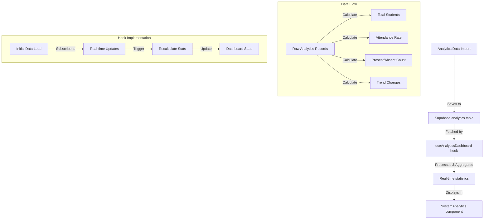

# Analytics Dashboard Fix Plan

## Problem
The SystemAnalytics dashboard is currently using hardcoded example data instead of showing real analytics data from the database, even though data is being properly imported into the 'analytics' table.

## Solution Architecture



## Implementation Steps

1. Create useAnalyticsDashboard Hook
   - Fetch analytics data from Supabase
   - Subscribe to real-time updates 
   - Process raw data to calculate statistics
   - Cache results for performance

2. Update SystemAnalytics Component
   - Remove hardcoded data
   - Integrate new hook
   - Add loading/error states
   - Implement data refresh on imports

3. Database Optimizations
   - Create materialized view for analytics summary
   - Add trend calculation functions
   - Optimize for real-time updates

4. Data Processing Logic
   - Calculate attendance rates and trends
   - Handle edge cases and validation
   - Implement error handling

## Technical Details

### Database Views
```sql
CREATE MATERIALIZED VIEW analytics_summary AS
SELECT 
    COUNT(DISTINCT student_id) as total_students,
    AVG(score) as avg_score,
    AVG(course_progress) as avg_progress,
    AVG(engagement_level) as avg_engagement
FROM analytics;
```

### Real-time Subscription
```typescript
// Subscribe to analytics changes
supabase
  .from('analytics')
  .on('INSERT', (payload) => {
    refreshDashboard();
  })
  .subscribe();
```

### Data Processing
```typescript
interface AnalyticsSummary {
  attendance: {
    total: number;
    present: number;
    absent: number;
    rate: number;
  };
  trends: {
    weeklyChange: number;
    monthlyChange: number;
  };
}

// Calculate trends by comparing current vs previous periods
const calculateTrends = (data: AnalyticsRecord[]) => {
  // Implementation details...
};