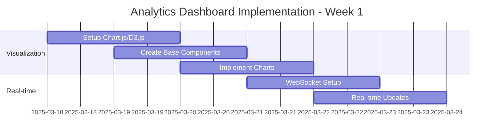
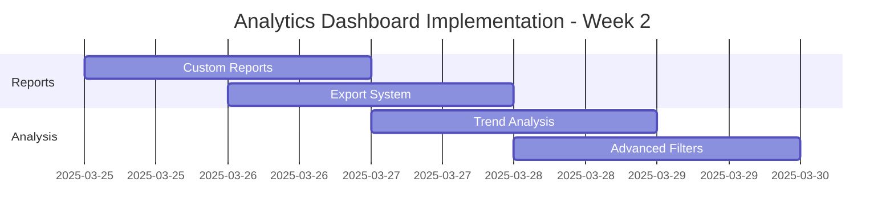
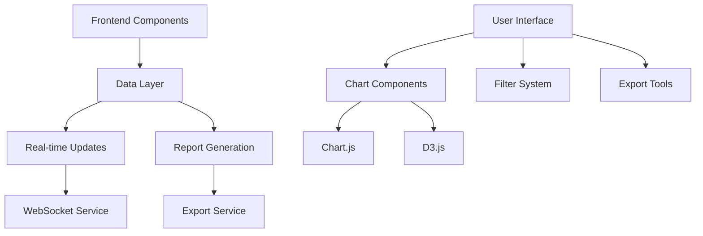

# Analytics Dashboard Implementation Plan

## Current Status
The admin portal has basic components for system settings, data rules, and data processing. The next major phase is implementing the Analytics Dashboard.

## Implementation Plan

### Week 1: Core Visualization & Real-time Updates



#### Day 1-2: Chart Library Setup
- Initialize Chart.js and D3.js integration
- Create base visualization components
- Set up chart configuration system
- Implement responsive chart layouts

#### Day 3-4: Core Visualizations
- Student performance trends
- Attendance analytics
- Course completion rates
- Resource utilization charts

#### Day 5-6: Real-time Integration
- WebSocket connection setup
- Real-time data subscription system
- Live update mechanisms
- Performance optimization

### Week 2: Advanced Features & Export



#### Day 1-2: Custom Reports
- Report template system
- Custom report builder interface
- Report scheduling
- Data aggregation tools

#### Day 3-4: Export Features
- PDF report generation
- Excel data export
- Chart image export
- Batch export capabilities

#### Day 5-6: Advanced Analysis
- Trend analysis algorithms
- Predictive analytics
- Advanced filtering system
- Custom metrics builder

## Technical Architecture



## Component Structure
```typescript
// Core visualization component
interface AnalyticsVisualization {
  type: 'line' | 'bar' | 'pie' | 'custom';
  data: DataSource;
  config: ChartConfig;
  realtime?: boolean;
}

// Real-time update system
interface RealTimeSubscription {
  topic: string;
  interval: number;
  dataTransformer: (data: any) => ChartData;
  onUpdate: (data: ChartData) => void;
}

// Export system
interface ExportTools {
  format: 'pdf' | 'excel' | 'image';
  template: ExportTemplate;
  data: ExportData;
  options: ExportOptions;
}
```

## Testing Strategy

### Unit Tests
- Chart rendering
- Data transformations
- Export formatting
- Real-time updates

### Integration Tests
- WebSocket connections
- Export generation
- Data synchronization
- Filter interactions

### Performance Tests
- Real-time update speed
- Large dataset handling
- Export generation time
- Chart rendering performance

## Success Metrics
1. Dashboard load time < 2s
2. Real-time update latency < 500ms
3. Export generation < 5s
4. Chart render time < 1s
5. Zero memory leaks
6. 100% test coverage

## Next Steps
1. Set up base Chart.js/D3.js environment
2. Create core visualization components
3. Implement WebSocket connection
4. Build report generation system

Would you like me to switch to Code mode to begin implementation of the Analytics Dashboard?