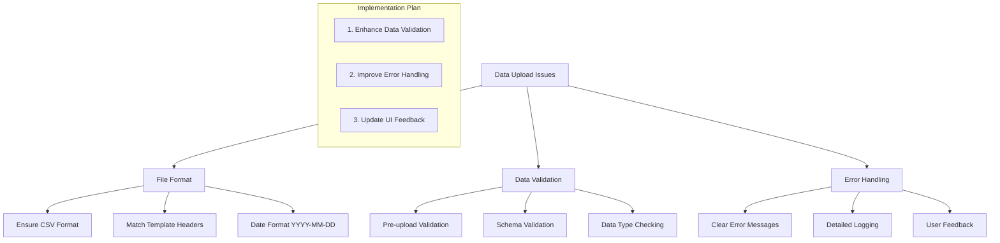

# Student Data Upload Fix Plan

## Current Issues Analysis

### Database Schema Requirements
- Email must be unique
- Admission date must be a valid date format
- Year of study must be between 1-6
- All fields except phone are required

### Data Processing Issues
- CSV column headers must exactly match expected format
- Better validation needed for data types
- Proper error handling required

## Implementation Plan

### 1. Enhance Data Validation
- Add strict validation for all required fields before upload attempt
- Validate email format and check uniqueness against database
- Ensure admission_date follows YYYY-MM-DD format
- Validate year_of_study is an integer between 1-6
- Check student_id uniqueness and format
- Implement proper name splitting for first_name and last_name fields

### 2. Improve Error Handling
- Add detailed error messages for specific validation failures:
  - Invalid email format
  - Duplicate email/student ID
  - Invalid date format
  - Invalid year of study
  - Missing required fields
- Implement comprehensive error logging for debugging
- Create user-friendly error messages in the UI

### 3. Update UI Feedback
- Display clear format requirements prominently
- Add visual feedback during validation process
- Show specific error messages for common issues
- Implement progress indicators during upload
- Add preview of processed data before final upload

## Success Criteria
- All required fields present and properly formatted
- Unique constraints maintained (email, student_id)
- Valid data types for all fields
- Clear error messages for any validation failures
- Successful data insertion into database