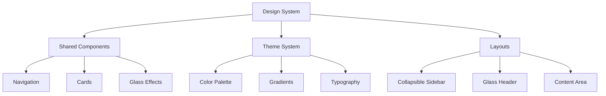

# Portal Redesign Plan

## Overview
Modernize both Student and Instructor portals by applying the futuristic design system while maintaining their distinct functionalities.

## Design System Implementation



### 1. Shared Components Enhancement

#### Navigation System
- Implement collapsible sidebar from FuturisticAdminPortal
- Add hover effects and transitions
- Maintain role-specific navigation items
- Apply glass effect styling

#### Card Components
- Modern gradient backgrounds
- Glass effect overlays
- Consistent padding and spacing
- Interactive hover states

#### Glass Effect System
- Semi-transparent backgrounds
- Backdrop blur effects
- Border highlights
- Shadow system

### 2. Layout Structure

#### Sidebar
```tsx
// Common sidebar structure
<div className={`${expanded ? 'w-64' : 'w-20'} 
  min-h-screen 
  bg-gray-800/50 
  backdrop-blur-xl 
  border-r border-gray-700/50 
  transition-all duration-300`}>
  {/* Content */}
</div>
```

#### Content Area
```tsx
// Common content area structure
<div className="flex-1 overflow-auto">
  <main className="min-h-screen bg-gradient-to-br from-gray-900 via-gray-900 to-gray-800">
    {/* Dynamic content */}
  </main>
</div>
```

### 3. Implementation Phases

#### Phase 1: Core Components
1. Create shared design system
2. Update layout components
3. Implement glass effects
4. Add animations and transitions

#### Phase 2: Portal-Specific Updates
1. Update StudentPortal
   - Apply new layout system
   - Enhance dashboard components
   - Update navigation

2. Update InstructorPortal
   - Apply new layout system
   - Enhance analytics views
   - Update management interfaces

#### Phase 3: Feature Enhancements
1. Add real-time notifications
2. Enhance interactive elements
3. Implement advanced animations
4. Add responsive improvements

### 4. Key Features to Preserve

#### Student Portal
- Course progress tracking
- Interactive calendar
- Assignments and grades
- Study materials
- Peer collaboration

#### Instructor Portal
- Attendance management
- Analytics dashboard
- Student management
- Communication tools
- Data import/export

## Technical Implementation

### Shared Components
```tsx
// Base layout component
const PortalLayout: React.FC<{
  role: 'student' | 'instructor';
  sidebarOpen: boolean;
  onToggleSidebar: () => void;
  children: React.ReactNode;
}> = ({...props}) => {
  return (
    <div className="flex h-screen bg-gray-900 text-gray-100">
      {/* Sidebar */}
      <Sidebar 
        role={props.role}
        expanded={props.sidebarOpen}
        onToggle={props.onToggleSidebar}
      />
      
      {/* Main Content */}
      <ContentArea>
        {props.children}
      </ContentArea>
    </div>
  );
};
```

### Glass Effect Components
```tsx
// Reusable glass card component
const GlassCard: React.FC<{
  children: React.ReactNode;
  className?: string;
}> = ({children, className}) => {
  return (
    <div className={`
      bg-gray-800/50 
      backdrop-blur-xl 
      border border-gray-700/50 
      rounded-xl 
      shadow-lg
      ${className}
    `}>
      {children}
    </div>
  );
};
```

## Success Criteria
1. Visual consistency across portals
2. Preserved functionality
3. Enhanced user experience
4. Improved performance
5. Responsive design