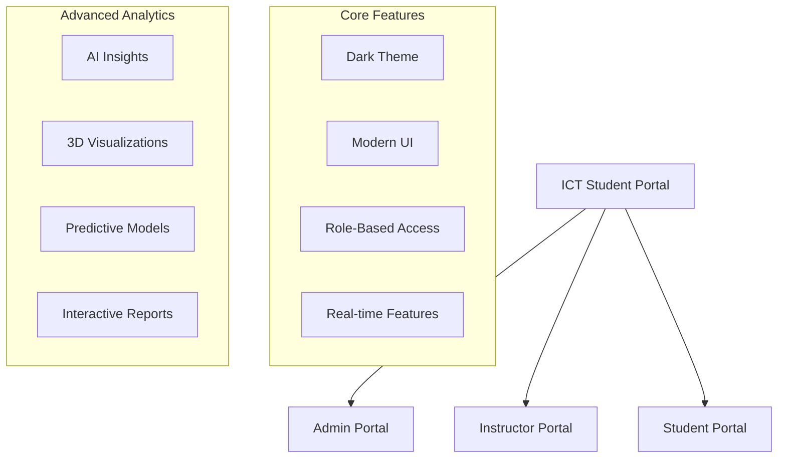
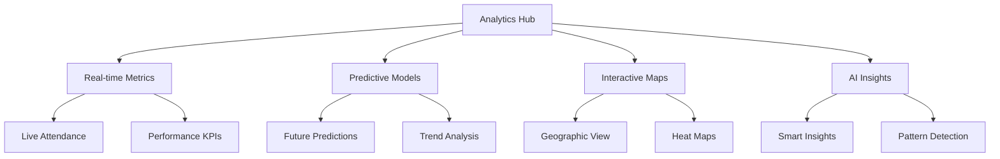
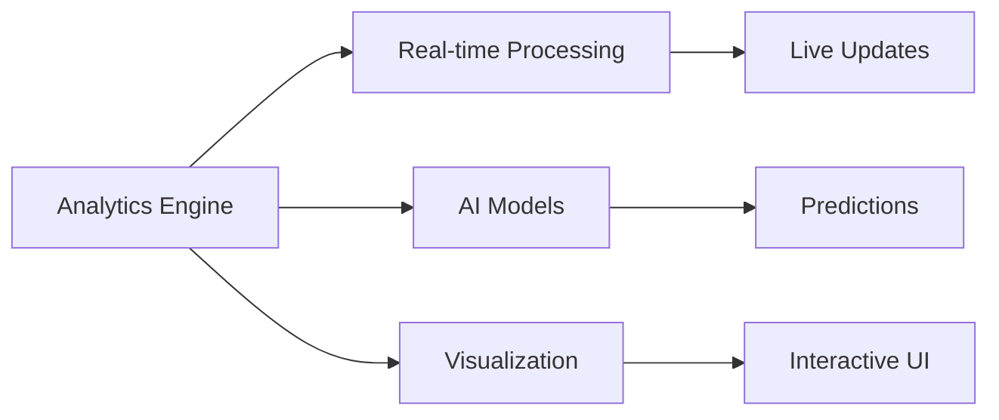

# Product Context Documentation

## Project Overview

The ICT Student Attendance Portal is a modern web application designed for tracking and managing student attendance in ICT Authority training programs, with advanced analytics capabilities and a futuristic dark theme design targeting a 2067 launch.

## User Roles

### 1. Administrator
Primary system manager with complete control over the platform.

#### Responsibilities
- User management
- System configuration
- Advanced analytics
- Report generation
- Performance monitoring
- Student data management
- AI insight review
- Full CRUD operations

#### Key Features
- Complete dashboard access
- User role management
- Advanced analytics suite
- Configuration controls
- Report generation tools
- Live activity monitoring
- Real-time notifications
- Predictive analytics
- Interactive visualizations
- AI-powered insights
- Student management
  - Add new students
  - Edit student details
  - Delete student records
  - Bulk operations
  - Export student data

### 2. Analytics Features

#### Advanced Analytics Dashboard

#### Interactive Data Explorer
- 3D data visualizations
- Time-travel analysis
- Comparative studies
- Drill-down capabilities
- Custom filters
- Export tools

#### Smart Dashboards
- Customizable widgets
- Drag-and-drop interface
- Real-time updates
- Interactive filters
- Data drill-down
- Export capabilities

#### Advanced Reports
- Custom report builder
- Template library
- Scheduled reports
- Multi-format export
- Interactive previews
- Collaboration tools

#### AI-Powered Features
- Pattern recognition
- Anomaly detection
- Predictive modeling
- Smart recommendations
- Automated insights
- Trend analysis

#### Performance Analytics
- Attendance metrics
- Performance scores
- Engagement index
- Student rankings
- Progress tracking
- Achievement monitoring

### 3. Data Visualization

#### Chart Types
- Interactive 3D charts
- Heat maps
- Geographic distributions
- Time series analysis
- Correlation plots
- Network graphs

#### Interactive Features
- Zoom and pan
- Data filtering
- Real-time updates
- Custom views
- Animation effects
- Touch gestures

#### Data Storytelling
- Narrative visualizations
- Interactive timelines
- Event mapping
- Impact analysis
- Success stories
- Performance journeys

## Core Features

### 1. Analytics Core

### 2. Enhanced Features
- AI-powered analytics
- 3D visualizations
- Predictive modeling
- Smart alerts
- Interactive dashboards
- Custom reporting
- Mobile optimization
- Real-time updates

### 3. Data Processing
- ETL pipeline
- Real-time processing
- AI analysis
- Pattern detection
- Trend analysis
- Automated insights

### 4. User Experience
- Interactive controls
- Smooth animations
- Responsive design
- Touch support
- Accessibility
- Dark theme

## Implementation Focus

### Phase 1: Core Analytics
- Analytics engine setup
- Basic visualizations
- Real-time processing
- Data models

### Phase 2: Advanced Features
- AI integration
- 3D visualizations
- Predictive models
- Interactive dashboards

### Phase 3: Enhancement
- Custom algorithms
- Advanced AI
- Performance optimization
- Feature expansion

## Success Metrics

### 1. Analytics Performance
- Processing speed < 500ms
- Real-time updates < 100ms
- Prediction accuracy > 90%
- Dashboard load time < 2s

### 2. User Engagement
- Interactive feature usage
- Custom report creation
- Dashboard customization
- Feature adoption rate

### 3. Technical Metrics
- System reliability
- Data accuracy
- Model performance
- Resource efficiency

## Future Considerations
- Advanced AI models
- Quantum computing integration
- Extended visualizations
- Custom algorithms
- API ecosystem
- Mobile applications
