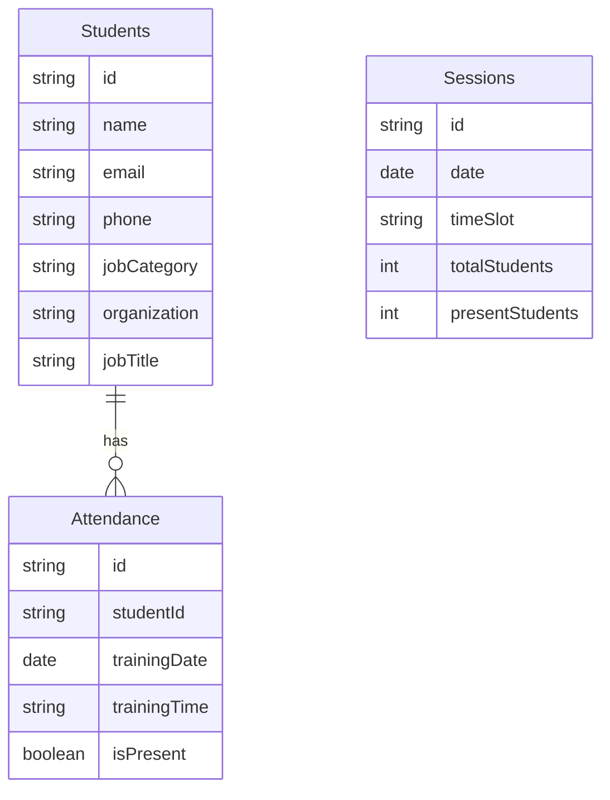
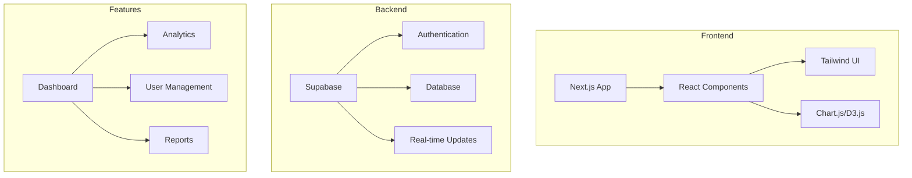

# ICT Student Attendance Portal Project Brief

## Project Overview
Creating a futuristic student attendance portal for ICT Authority, transforming Excel-based tracking into a modern web platform. Launch target: 2067.

## Core Requirements

### 1. User Interface
- Modern, futuristic design
- Interactive dashboards
- Data visualization (graphs, charts)
- Dark mode support
- Mobile-first responsive design

### 2. Technical Stack
- Frontend: Next.js 14+ with TypeScript
- Backend: Supabase
- Styling: Tailwind CSS
- Visualization: Chart.js/D3.js
- Real-time updates

### 3. Key Features
- Student attendance tracking & visualization
- Dynamic analytics dashboard
- Attendance trends analysis
- Excel data import/export
- Session management
- User role management

### 4. System Architecture

### 5. Data Management
- Structured student records
- Automated attendance tracking
- Historical data analysis
- Real-time analytics
- Data backup & recovery

## Implementation Timeline

### Phase 1: Core Infrastructure
- Database schema setup
- Authentication system
- Basic UI components
- Data import functionality

### Phase 2: Feature Development
- Student dashboard
- Admin interface
- Analytics implementation
- Report generation

### Phase 3: Enhancement
- Advanced visualizations
- Performance optimization
- Mobile responsiveness
- Dark mode implementation

### Phase 4: Launch
- Testing & validation
- Documentation
- Deployment preparation
- User training materials

## Success Metrics
- < 2s page load time
- 99.9% uptime
- < 500ms response time
- 100% data accuracy
- 95% user satisfaction

## Security Standards
- Role-based access control
- Data encryption
- Audit logging
- Regular backups
- Compliance checks
