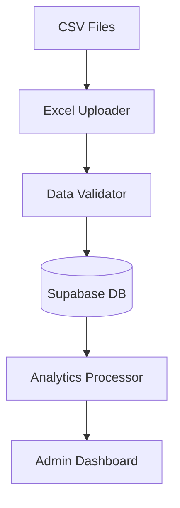

# System Patterns and Architecture - March 14, 2025

## Data Flow Architecture


## Data Validation Patterns
1. Student Data
   - Unique student IDs (ICT2025XXX format)
   - Valid email addresses
   - Required fields check
   - Date format validation
   - Year of study range (1-6)

2. Analytics Data
   - Foreign key validation (student_id)
   - Score range validation (0-100)
   - ISO date format for timestamps
   - Required fields presence

## Error Handling Strategy
```typescript
try {
  // Data processing
  validateData()
  checkDuplicates()
  insertData()
} catch (err) {
  // Error categorization
  if (err instanceof ValidationError) {
    // Handle validation errors
  } else if (err instanceof DatabaseError) {
    // Handle database errors
  }
}
```

## Database Security Patterns
1. Row Level Security (RLS)
   - Read access policies
   - Insert access policies
   - Role-based restrictions

2. Data Integrity
   - Foreign key constraints
   - Check constraints
   - Unique constraints
   - Not null constraints

## Component Patterns
1. Data Import
   ```
   DataImport
   ├── ExcelUploader
   ├── ValidationLayer
   └── FeedbackDisplay
   ```

2. Analytics
   ```
   Analytics
   ├── DataProcessor
   ├── Visualization
   └── ExportTools
   ```

## Testing Patterns
1. Data Validation
   - Format checks
   - Constraint validation
   - Duplicate detection

2. Integration
   - File upload
   - Database operations
   - Error handling

## Logging Strategy
- Import operations
- Validation results
- Error details
- Performance metrics

## Future Considerations
1. Batch Processing
2. Real-time Updates
3. Data Export
4. Analytics Expansion
