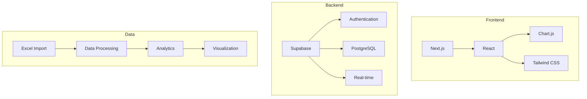

# Technical Context Documentation

# Technical Context Documentation

## Technology Stack Overview



## Development Environment

### 1. Core Technologies
- **Next.js 14+**
  - App Router
  - Server Components
  - API Routes
  - Server Actions

- **Supabase**
  - Database
  - Authentication
  - Real-time
  - Storage

- **Data Visualization**
  - Chart.js/D3.js
  - Real-time updates
  - Interactive charts
  - Custom dashboards

### 2. Frontend Dependencies
- **UI/UX**
  - Tailwind CSS
  - Headless UI
  - React Icons
  - Framer Motion

- **State & Data**
  - React Context
  - React Query
  - Local Storage
  - Excel.js

- **Charts**
  - Chart.js
  - D3.js
  - ReCharts
  - Victory

### 3. Development Tools
- **Quality Assurance**
  - ESLint
  - Prettier
  - Jest
  - React Testing Library

- **Performance**
  - Lighthouse
  - Web Vitals
  - Bundle analyzer
  - Performance monitoring

## Infrastructure

### 1. Deployment
- **Hosting**
  - Vercel
  - Supabase

- **CI/CD**
  - GitHub Actions
  - Automated tests
  - Preview deployments

### 2. Services

#### Data Processing
- Excel Import/Export
  - XLSX parsing
  - Data validation
  - Batch processing
  - Error handling

- Analytics Engine
  - Real-time stats
  - Historical data
  - Trend analysis
  - Custom reports

#### Notifications
- Email alerts
- In-app notifications
- Status updates
- System alerts

## Setup Guide

### 1. Local Development
```bash
# Required versions
Node.js: >= 18.17.0
npm: >= 9.0.0
Git: >= 2.30.0

# Installation
npm install
npm run dev

# Environment variables
NEXT_PUBLIC_SUPABASE_URL=your_url
NEXT_PUBLIC_SUPABASE_ANON_KEY=your_key
```

### 2. Database Structure
```sql
-- Core tables
CREATE TABLE students (
  id UUID PRIMARY KEY,
  name TEXT,
  email TEXT UNIQUE,
  phone TEXT,
  job_category TEXT,
  organization TEXT,
  job_title TEXT
);

CREATE TABLE sessions (
  id UUID PRIMARY KEY,
  date DATE,
  time_slot TEXT,
  total_students INT,
  present_students INT
);

CREATE TABLE attendance (
  id UUID PRIMARY KEY,
  student_id UUID REFERENCES students(id),
  session_id UUID REFERENCES sessions(id),
  is_present BOOLEAN,
  marked_at TIMESTAMP
);
```

### 3. API Endpoints
- `/api/students`
- `/api/sessions`
- `/api/attendance`
- `/api/reports`
- `/api/analytics`

## Technical Requirements

### 1. Browser Support
- Modern browsers
- Mobile responsive
- PWA capable
- Offline support

### 2. Performance
- Load time < 2s
- FCP < 1s
- TTI < 3s
- Lighthouse > 90

### 3. Security
- Role-based access
- Data encryption
- Input validation
- Rate limiting

### 4. Accessibility
- WCAG 2.1
- Keyboard navigation
- Screen readers
- High contrast

## Dependencies

### Core Dependencies
```json
{
  "dependencies": {
    "next": "^14.0.0",
    "react": "^18.2.0",
    "react-dom": "^18.2.0",
    "@supabase/supabase-js": "^2.x",
    "chart.js": "^4.x",
    "xlsx": "^0.18.x",
    "tailwindcss": "^3.x",
    "@headlessui/react": "^1.x"
  }
}
```

### Development Dependencies
```json
{
  "devDependencies": {
    "typescript": "^5.x",
    "eslint": "^8.x",
    "jest": "^29.x",
    "prettier": "^3.x"
  }
}
```

## Maintenance

### 1. Updates
- Weekly dependencies
- Monthly security
- Quarterly reviews
- Version updates

### 2. Monitoring
- Error tracking
- Performance
- Usage analytics
- System health

### 3. Backup
- Daily database
- Config backup
- Version control
- Recovery plans
